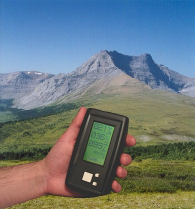

Nomad was a class project that Luke Hirschy and I developed our junior year at the University of Iowa.
We planned on making a portable weather station that could be used for backpacking or other similar outdoor activities.
It displays temperature, humidty, pressure, and altitude in both standard and metric units.

It uses a PIC16F877 microcontroller, a SHT11 humidity/temperature sensor, a MPX4115A, and a CFAG12864B 128x64 graphical LCD.
Relocatable assembly code is available for all these components. Feel free to use any of this code under the terms of the GPL.
In general most of the things work but there are still some bugs in the code. I don't plan on doing much more work on it so use it as is.

There is some interesting code we wrote to create a font table in the PICs program memory.
This allowed us to dynamically create the numbers and letters for the screen.
Check it out if you are trying to use a graphical LCD with a PIC.

## Design Resources
* [Project Source](https://github.com/maihde/nomad-wx)